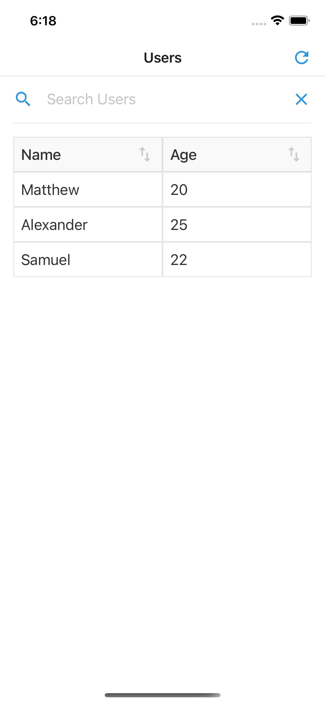
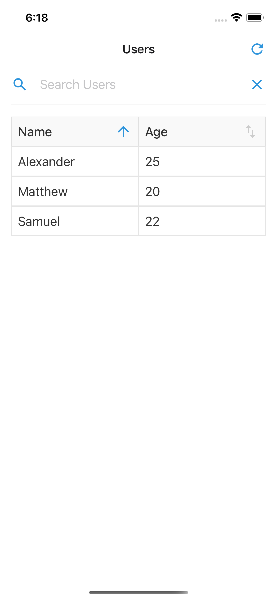
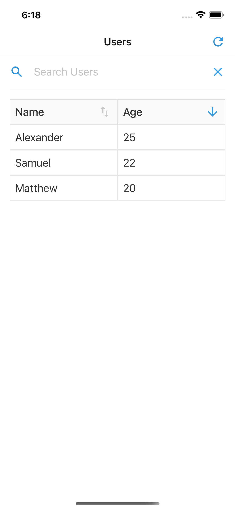
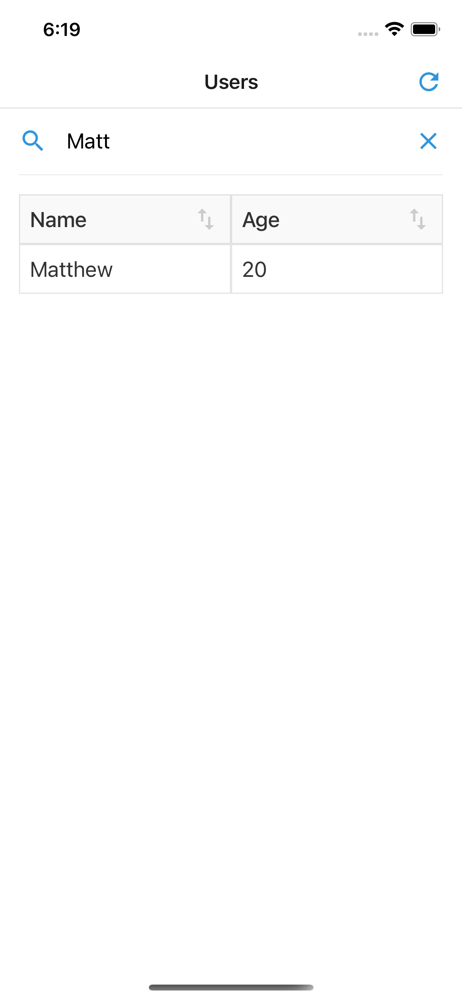

# Coding Challenge

## Setup Instructions

1. Clone this repository
2. Open project directory
3. Install Expo Cli using `npm install -g expo-cli`
4. Install dependencies using `yarn install` or `npm install`
5. Start Expo project `yarn start`
6. Run on Android Emulator `yarn android`
7. Run on iOS Simulator `yarn ios`

## Screenshots

  
  
  
  

